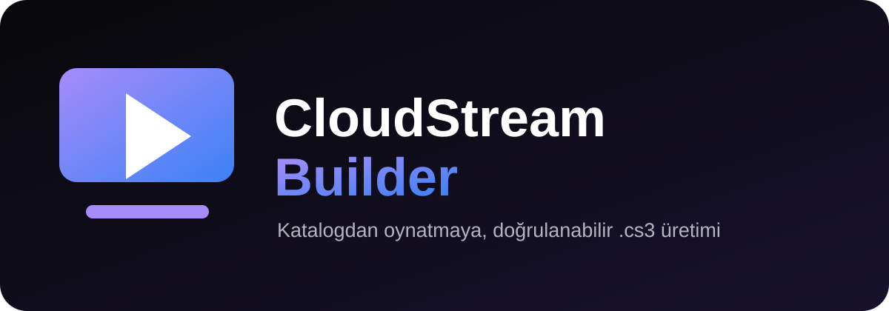

<p align="center">
  
</p>

<p align="center">
  <strong>Yarı otonom CloudStream eklenti oluşturucu.</strong>
</p>

<p align="center">
  <a href="https://github.com/Wiojelt/TurkSinema">TurkSinema</a> ·
  <a href="https://github.com/Wiojelt/TurkSpor">TurkSpor</a> ·
  Telegram: <strong>@wioj3lt</strong>
</p>

---

## Neler yapar?

- Film, dizi ve canlı yayın sağlayıcılarını ayrı akışlarla analiz eder.
- Sitedeki gerçek kategori adlarını, posterleri, detay bilgilerini ve bölümleri çıkarır.
- Kaynak seçici, AJAX oynatıcı, iframe ve doğrudan HLS/DASH bağlantılarını ayırt eder.
- Çoklu kaynakları, kalite etiketlerini ve altyazıları korur.
- Derlenmiş `.cs3` ile aynı sürüme ait kaynak paketini üretir.
- Derleme ile gerçek oynatma doğrulamasını birbirinden ayırır.
- TurkSinema ve TurkSpor'dan çıkarılan denenmiş katalog, player, domain, HLS, ayarlar ve paketleme yöntemlerini karar kütüphanesi olarak kullanır.

## Denenmiş yöntem kütüphanesi

Beceri artık mevcut sağlayıcı depolarını tarayarak kullanılan yaklaşımı sınıflandırabilir. Film/dizi tarafında klasik HTML, kaynak seçici AJAX, özel extractor ve uygulama API'si; canlı yayın tarafında dönen domain, geç çözümlenen kanal kimliği, çoklu yedek kaynak, ülke filtresi ve HLS kalite ayrıştırma modellerini birbirinden ayırır.

Bu yöntemler körlemesine kopyalanmaz. Hedef sitenin istek zinciri eşleşiyorsa uygulanır; derleme, HTTP kontrolü ve gerçek CloudStream oynatması ayrı sonuçlar olarak kaydedilir.

## Nasıl çalışır?

```text
Site / izinli API
        ↓
Kategori ve örnek içerik keşfi
        ↓
Film + dizi detay ve player isteği analizi
        ↓
CloudStream Kotlin sağlayıcısı
        ↓
Derleme → yapısal denetim → gerçek oynatma testi
        ↓
                  .cs3
```

## Kullanım örneği

Codex içinde:

```text
$cloudstream-builder https://ornek.site için film ve dizi eklentisi oluştur.
```

Beceri; belirsiz bir kartın medya, açıklama veya gereksiz bölüm olup olmadığını gerektiğinde sorar. Sonraki çalışmalarda doğrulanmış site kalıplarından yararlanır, fakat her sitenin oynatıcı isteğini ayrıca kontrol eder.

## Kurulum

Depoyu klonlayıp `cloudstream-builder` klasörünü Codex becerileri dizinine kopyalayın:

```powershell
git clone https://github.com/Wiojelt/CloudStream-Builder.git
Copy-Item -Recurse -Force .\CloudStream-Builder\cloudstream-builder "$env:USERPROFILE\.codex\skills\cloudstream-builder"
```

Codex yeniden başlatıldıktan sonra beceri `$cloudstream-builder` adıyla kullanılabilir.

## Durum

CloudStream Builder amatör bir geliştirici tarafından geliştirilmektedir ve her türlü katkı, öneri, hata bildirimi ve desteğe açıktır. Beceri kodu, tarifler, ikonlar ve denetim aracı bu tek açık kaynak deposunda yer alır.

## İlkeler

- Yalnızca kullanıcının yetkilendirdiği kaynaklar üzerinde çalışır.
- Kişisel çerez, token, parola ve cihaz verisini paketlere eklemez.
- “Derlendi” ile “CloudStream'de oynatıldı” durumlarını ayrı raporlar.
- Kaynakta bulunmayan altyazı, bölüm veya kaliteyi uydurmaz.

## Teşekkür ve atıf

Bu proje, açık kaynak [ReCloudStream / CloudStream](https://github.com/recloudstream/cloudstream) ekosistemi için bağımsız bir topluluk aracıdır. CloudStream ve ilgili markalar kendi geliştiricilerine aittir; bu depo resmî CloudStream projesi değildir.

Katkıda bulunmak için [issue açabilir](https://github.com/Wiojelt/CloudStream-Builder/issues) veya pull request gönderebilirsiniz.

---

<p align="center">
  <sub>CloudStream Builder · by Wiojelt</sub>
</p>
